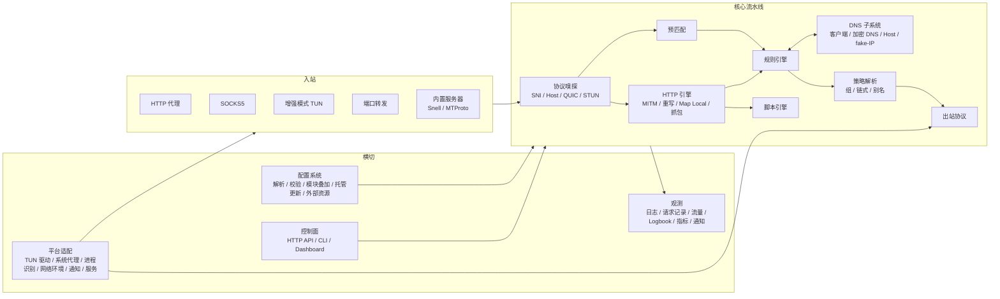

# rurge 需求文档（PRD）

| 项 | 内容 |
| --- | --- |
| 文档版本 | 0.1（草案） |
| 日期 | 2026-09-03 |
| 状态 | 待评审 |
| 参考基线 | Surge 官方手册 <https://manual.nssurge.com/>（2026-09 版本，对应 Surge Mac 6.9 / Surge iOS 5.22） |
| 附录 | [Surge 兼容性清单](surge-compatibility-matrix.md)：逐项列出每个 Surge 配置项、规则、参数、API 在 rurge 中的计划状态 |

## 目录

1. [项目概述](#1-项目概述)
2. [范围](#2-范围)
3. [总体架构需求](#3-总体架构需求)
4. [功能需求](#4-功能需求)
5. [非功能需求](#5-非功能需求)
6. [平台差异矩阵](#6-平台差异矩阵)
7. [分阶段路线图](#7-分阶段路线图)
8. [验收与测试策略](#8-验收与测试策略)
9. [风险与开放问题](#9-风险与开放问题)
10. [附录 A：参考资料](#附录-a参考资料)

---

## 1. 项目概述

### 1.1 背景

Surge 是 Apple 平台上功能最完整的网络代理与调试工具之一：规则引擎、十余种出站协议、增强模式（虚拟网卡接管）、HTTPS 解密与重写、JavaScript 脚本、模块系统、HTTP API 与 Dashboard。围绕它沉淀了大量社区资产：规则集、`.sgmodule` 模块、脚本、策略订阅、第三方面板。但 Surge 只有 macOS 与 iOS 版本，Windows 与 Linux 用户无法复用这些资产，也没有一个开源实现以 Surge 的配置格式和 API 为兼容目标。

### 1.2 产品定位

**rurge 是用 Rust 实现的跨平台 Surge 兼容核心。** 它的目标是逐步复刻 Surge 的全部功能，让 Surge 的配置文件、模块、脚本、订阅以及基于 HTTP API 的工具在 Windows、Linux 与 macOS 上原样可用。

它不是"另一个代理内核再加一个 Surge 格式转换器"，而是把 Surge 的配置格式与运行时语义作为一等公民：配置格式即 Surge 格式，脚本 API 即 Surge API，HTTP API 即 Surge HTTP API。

### 1.3 目标

| 编号 | 目标 | 衡量方式 |
| --- | --- | --- |
| G1 | 配置兼容：任何符合手册语法的 Surge 配置都能加载；已实现功能的行为与 Surge 一致 | 兼容性语料库零加载错误；差异全部登记在兼容性清单 |
| G2 | 生态复用：社区规则集、模块、脚本、订阅、面板无需修改即可使用 | 样本集运行通过率 |
| G3 | 核心优先：单二进制守护进程，无 GUI 也能使用全部功能 | 所有功能可由 CLI / API 驱动 |
| G4 | 跨平台一致：三个桌面平台功能差异最小化，剩余差异显式记录 | 平台差异矩阵（第 6 节） |
| G5 | 安全默认：默认只监听回环、API 强制密钥、UDP 不支持时默认拒绝、敏感信息脱敏 | 非功能需求 NFR-03 |

### 1.4 目标用户

- 已有 Surge 配置、希望在 Windows / Linux 上复用的用户；
- 需要"规则分流 + 抓包 + 重写 + 脚本"组合能力做网络调试的开发者；
- 在家庭网关或服务器上运行代理核心的用户（网关模式、DHCP、端口转发、内置服务器）；
- 用 HTTP API 集成自动化或监控（Prometheus）的运维用户。

### 1.5 设计原则

1. **兼容优先于创新**：先做到与 Surge 一致，再考虑扩展；扩展不得改变 Surge 语法的含义。
2. **解析但忽略，而非拒绝**：平台不适用或尚未实现的配置项，加载时记录日志而不是报错，保证同一份配置可在 Surge 与 rurge 之间共享。
3. **核心先行**：守护进程 + CLI + API 是产品本体，GUI 是后期的外壳。
4. **可观测**：每一次拒绝、失败、分流都能回溯到具体规则与策略。
5. **模块化**：按职责拆分 crate，每个 crate 有清晰的公共接口并可独立测试。
6. **安全默认**：所有对外监听默认关闭或限于回环，凭据不落日志。

### 1.6 术语表

| 术语 | 含义 |
| --- | --- |
| Profile / 配置 | Surge 的 `.conf` 配置文件，INI 风格，多个节 |
| 托管配置 | 以 `#!MANAGED-CONFIG` 开头、从 URL 自动更新的配置 |
| 模块 | `.sgmodule` 文件，叠加在配置之上并可独立开关的设置片段 |
| 策略 | 出站方式：内置策略（DIRECT / REJECT 系）、代理策略（`[Proxy]`）、策略组 |
| 策略组 | 把多个策略封装成一个名字，按手动 / 延迟 / 可用性 / 负载 / 智能 / 网络环境选择 |
| 规则 | `[Rule]` 中的一行 `TYPE,VALUE,POLICY[,params]`，自上而下首个命中 |
| 规则集 / 域名集 | 外部或内联的规则列表 / 域名列表 |
| 出站模式 | `direct`（全部直连）/ `proxy`（全局代理）/ `rule`（按规则） |
| 增强模式 / VIF / TUN | 创建虚拟网卡并作为默认路由接管全部 IP 流量 |
| fake-IP | 增强模式下 DNS 应答器立即返回的 `198.18.0.0/15` 虚拟地址，连接到达时反查域名 |
| HTTP 引擎 | 把 TCP 流按 HTTP 消息解析的组件，是抓包、重写、脚本的前提 |
| MITM | 用本地 CA 对指定主机名做 HTTPS 解密 |
| 重写 | URL Rewrite / Header Rewrite / Body Rewrite / Map Local 的统称 |
| 脚本 | `[Script]` 声明的 JavaScript，七种类型 |
| Host List | Surge 的一种参数类型：带排除、通配与端口语义的主机列表 |
| 子网表达式 | `SSID:` `BSSID:` `ROUTER:` `TYPE:` `MCCMNC:` 形式的当前网络描述 |
| 预匹配（pre-matching） | 带 `pre-matching` 标记的 REJECT 规则在 DNS 与 TCP 握手阶段提前执行 |
| 链式代理 | `underlying-proxy`：先连接底层策略，再经它连接目标代理 |
| Keystore | `[Keystore]` 节，存放 p12 证书与 OpenSSH 私钥 |
| Logbook | 持久化的事件记录（配置重载、网络切换、脚本运行等） |
| 兼容性清单 | 本文档附录，逐项标注 Surge 特性在 rurge 中的状态 |

---

## 2. 范围

### 2.1 目标平台

| 平台 | 版本 | 架构 | 说明 |
| --- | --- | --- | --- |
| Windows | 10 及以上 | x86_64、aarch64 | 增强模式需要管理员权限（Wintun 驱动） |
| Linux | 主流发行版（glibc）；musl 静态构建为次要目标 | x86_64、aarch64 | 增强模式需要 `CAP_NET_ADMIN` |
| macOS | 12 及以上 | arm64、x86_64 | 增强模式需要 root（utun） |

### 2.2 产品形态

| 形态 | 说明 | 阶段 |
| --- | --- | --- |
| `rurge` 二进制 | 同时是守护进程与命令行客户端：`run` / `check` 本地执行，其余子命令通过 HTTP API 控制运行中的实例 | 1 起 |
| HTTP API | 与 Surge HTTP API 路径、方法、字段一致 | 1 骨架，6 完整 |
| Web Dashboard | 内嵌于二进制，由 API 端口提供 | 6 |
| 系统服务 | systemd / launchd / Windows 服务安装与自启 | 1 基础，6 完整 |
| 桌面 GUI | 独立进程，通过 API 控制核心；托盘、策略切换、请求查看、配置编辑 | 8 |

### 2.3 范围内

- Surge 配置格式全部语法、`[General]` 全部选项、模块、托管配置、Requirement 表达式、Keystore；
- 入站：HTTP / SOCKS5 代理、局域网共享、系统代理设置、增强模式、端口转发、内置 Snell / MTProto 服务器；
- 出站：手册列出的全部协议类型（Tailscale 除外，见非目标）与全部参数；
- 策略组六种类型、策略引入与订阅；
- 规则系统 29 种规则类型与 10 个参数、规则集、GeoIP / ASN；
- DNS：内部客户端、加密 DNS、本地映射、fake-IP 应答器；
- HTTP 处理：HTTP 引擎、MITM、四种重写、Map Local、抓包；
- 脚本：七种脚本类型与完整 JavaScript API；
- 信息面板、Logbook、通知、HTTP API、Prometheus 指标、CLI；
- 网关模式、DHCP 服务器、设备管理（Linux / macOS 优先）。

### 2.4 非目标

| 非目标 | 原因 | 处理 |
| --- | --- | --- |
| iOS / tvOS 版本 | 需要 Swift、Xcode 与 Network Extension，无法在 Windows 开发 | iOS 专属配置项解析后忽略 |
| Surge Ponte | 依赖 iCloud 账号体系与专有协议 | `[Ponte]` 节忽略；文档给出 WireGuard 替代方案 |
| Apple 专属界面：菜单栏、小组件、快捷指令、Surge Dashboard 原生应用 | 平台专属 | 功能通过 API / CLI / Web Dashboard 提供 |
| Surge Dashboard 的原生控制协议（`external-controller-access`） | 专有协议 | 远程控制统一走 HTTP API |
| 企业配置、许可证相关 URL Scheme | 商业功能 | 忽略 |
| Tailscale 策略 | 需嵌入 Tailscale 客户端（控制面协议、DERP、MagicDNS），工作量与许可需单独评估 | 远期评估；配置解析通过，策略视为不可用 |
| Metered Network Mode（按应用限制联网） | Surge Mac 专属 UI 功能 | 远期评估 |
| Snell v5 / v6、Hysteria 2 的 Gecko 混淆 | 协议细节未公开 | 待评估；v1–v4 与 Salamander 在范围内 |

### 2.5 与 Surge 的关系

- rurge 是独立的开源项目，与 Surge 的开发者 NSSurge 没有任何关系；"Surge" 是其所有者的商标，本项目仅用于描述兼容性。
- rurge 不包含、不分发 Surge 的代码、二进制或资源文件；兼容性实现基于公开手册与公开协议规范。对于非公开协议（如 Snell），只依据社区已知的实现。
- 内置规则集 `SYSTEM` / `LAN` 的内容按手册当前清单实现，并在文档中注明来源。

---

## 3. 总体架构需求

### 3.1 逻辑架构

### 3.2 模块划分

按职责拆分为 Cargo workspace 中的多个 crate。以下是建议划分，阶段 1 的设计文档可调整命名，但必须保持"每个 crate 一个清晰职责、可独立测试"的原则。

| crate | 职责 | 主要依赖 |
| --- | --- | --- |
| `rurge-config` | 配置解析与校验、`#!include`、模块叠加、托管配置、Requirement 表达式、外部资源管理、运行时状态持久化 | 无内部依赖 |
| `rurge-rules` | 规则类型与匹配、规则集 / 域名集索引、逻辑规则、GeoIP / ASN 查询、临时规则、命中计数 | `rurge-config` |
| `rurge-dns` | 内部 DNS 客户端、加密 DNS、`[Host]` 映射、缓存、fake-IP 池与应答器 | `rurge-config` |
| `rurge-policy` | 策略模型、策略组算法、连通性测试、策略引入与订阅、选择持久化 | `rurge-config` `rurge-proto` |
| `rurge-proto` | 出站抽象（`Outbound` / `Dialer` / `Datagram`）、DIRECT / REJECT、传输层（TLS / Shadow TLS / WebSocket / obfs / HTTP/2 连接池）、TCP 与 TLS 上的流式协议、UDP 中继、链式代理、网卡绑定 | `rurge-net` |
| `rurge-proto-quic` | QUIC 族出站协议（TUIC、Hysteria 2、MASQUE、Trust Tunnel 的 HTTP/3 模式）（阶段 2 设计文档 D4） | `rurge-proto` |
| `rurge-proto-ssh` | SSH 出站 | `rurge-proto` |
| `rurge-proto-wireguard` | WireGuard 出站与其用户态协议栈 | `rurge-proto` |
| `rurge-net` | 内部 HTTP 客户端、连接器抽象、外部资源管理器（下载 / 缓存 / 更新间隔 / 文件监视） | `rurge-config` |
| `rurge-inbound` | HTTP / SOCKS5 监听、端口转发、内置 Snell / MTProto 服务器、局域网访问限制 | `rurge-config` |
| `rurge-tun` | 虚拟网卡驱动适配、用户态 TCP/IP 栈、路由管理、UDP 会话表、ICMP、网关模式、DHCP 服务器 | `rurge-dns` |
| `rurge-http` | HTTP 引擎、MITM 与 CA 管理、URL / Header / Body 重写、Map Local、请求记录与抓包 | `rurge-rules` `rurge-policy` |
| `rurge-script` | JavaScript 引擎封装、Surge API 绑定、脚本调度与限制、persistentStore | `rurge-http` `rurge-policy` |
| `rurge-engine` | 会话流水线编排、请求记录、流量统计、运行时状态、热重载 | 各领域 crate |
| `rurge-api` | HTTP API、鉴权与封禁、Prometheus 指标、Web Dashboard 静态资源、事件中心 / Logbook | 全部 |
| `rurge-platform` | 进程识别、系统代理设置、网络环境探测、系统通知、服务安装、数据目录 | 无内部依赖 |
| `rurge`（bin） | 守护进程组装、CLI 子命令、交互模式 | 全部 |

架构级需求：

| 编号 | 需求 |
| --- | --- |
| AR-01 | 每个 crate 的公共接口有文档注释，且能在不启动完整守护进程的情况下被单独测试 |
| AR-02 | 平台特定代码只出现在 `rurge-platform` 与 `rurge-tun`，其他 crate 通过 trait 依赖抽象 |
| AR-03 | 运行时使用 tokio 异步模型；每个连接是独立任务，单连接 panic 不影响进程 |
| AR-04 | 配置对象不可变；重载时构建新对象并原子切换，新连接使用新配置，已有连接继续使用旧配置直至结束 |
| AR-05 | 所有对外行为（规则命中、策略选择、DNS 结果、重写与脚本）产生可关联的事件，供请求记录与日志使用 |

### 3.3 连接处理流水线

每一个 TCP 连接或 UDP 会话按以下顺序处理：

1. **入站接收**：来源为本地代理端口、局域网客户端、TUN 或端口转发；收集元数据：源 IP / 端口、监听端口、目标（域名或 IP）、进程路径（本机连接）、设备名 / MAC（网关模式）。
2. **协议嗅探**：TLS ClientHello 的 SNI、HTTP Host / `:authority`、QUIC、STUN、MTProto；受 `always-raw-tcp-*` 与 `force-http-engine-hosts` 影响。
3. **预匹配**：带 `pre-matching` 的 REJECT 规则；增强模式下这一步提前到 DNS 查询与 TCP SYN 阶段。
4. **出站模式判断**：`direct` / `proxy` 直接得到策略，跳过规则。
5. **规则匹配**：自上而下；域名规则不触发 DNS；遇到 IP 规则时按需解析并在本次评估内缓存；`no-resolve` / `dns-failed` 语义。
6. **策略解析**：策略组决策（含临时覆盖）、别名、`underlying-proxy` 链、UDP 支持判断。
7. **出站建立**：网卡绑定、`ip-version`、TFO / TOS / ECN、QUIC 阻断、UDP 中继。
8. **HTTP 引擎**（若适用）：MITM 解密 → Header Rewrite → URL Rewrite → Body Rewrite → 脚本 → Map Local 短路。
9. **观测**：请求记录（含规则、策略、耗时、流量、备注）、流量统计、日志、通知。

### 3.4 配置生命周期

| 阶段 | 需求 |
| --- | --- |
| 加载 | 读取主配置 → 展开 `#!include` → 应用 Requirement 表达式 → 解析各节 → 叠加已启用模块 → 校验 |
| 校验 | 区分**错误**（拒绝加载，如缺少 FINAL、未知策略引用）与**警告**（继续加载，如未知键、平台不适用项、非法 Host List 项） |
| 生效 | 校验通过后原子切换；失败则保留当前配置并报告 |
| 热重载 | 触发方式：CLI `reload`、API `POST /v1/profiles/reload`、SIGHUP（Unix）、配置文件变化（可选） |
| 托管更新 | 按 `interval` 检查；`strict` 语义；失败保留旧版本；更新后触发重载并写 Logbook |
| 外部资源 | 规则集、域名集、脚本、订阅、Map Local URL 各自的 `update-interval`、磁盘缓存、失败重试、本地文件监视 |
| 状态持久化 | select 组选择、出站模式与全局策略、功能开关、临时覆盖、fake-IP 映射、`$persistentStore`、Logbook、设备表、封禁表；存放于数据目录 |

### 3.5 运行时状态模型

以下状态独立于配置文件，可通过 API / CLI 读写，并在重启后恢复：

| 状态 | 取值 | 持久化 |
| --- | --- | --- |
| 出站模式 | `direct` / `proxy` / `rule` | 是 |
| 全局策略 | 策略名 | 是 |
| 功能开关 | `mitm` `capture` `rewrite` `scripting` `system_proxy` `enhanced_mode` | 是（`system_proxy` / `enhanced_mode` 重启时按启动参数决定） |
| 策略组选择与临时覆盖 | 组名 → 策略名 | 是（按 Profile） |
| 临时规则 | 规则列表 | 否 |
| 封禁表 | 来源 IP → 到期时间 | 是 |
| 日志级别（会话内覆盖） | 级别 | 否 |

---

## 4. 功能需求

编号规则：`FR-<模块>-<序号>`。优先级：**P0** 该阶段必须完成；**P1** 该阶段应完成，可顺延一个阶段；**P2** 有则更好。阶段编号见第 7 节。逐项的 Surge 配置键、参数与取值以[兼容性清单](surge-compatibility-matrix.md)为准，本节不重复罗列。

### 4.1 配置与 Profile（CFG）

| 编号 | 需求 | 优先级 | 阶段 |
| --- | --- | --- | --- |
| FR-CFG-01 | 解析 Surge INI 格式：节、`key = value`、有序行、三种注释、行内注释、引号值与 `\"` `\\` 转义、含逗号的引号值 | P0 | 1 |
| FR-CFG-02 | 未识别的节与键保留在内存并记录警告，不阻止加载；rurge 不改写用户配置文件 | P0 | 1 |
| FR-CFG-03 | 校验区分错误与警告；`rurge check` 输出文件、行号、原因与建议；退出码区分错误 / 仅警告 / 通过 | P0 | 1 |
| FR-CFG-04 | `#!include`：单文件、多文件、与普通内容混合（按位置展开）、通配命名节、远程 URL；相对路径基于配置文件所在目录 | P0 | 1 |
| FR-CFG-05 | 托管配置：`#!MANAGED-CONFIG <URL> interval= strict=`；缓存、按间隔更新、`strict` 到期未更新成功时拒绝启动新会话但保留 API 可用、更新后自动重载并记录 Logbook | P0 | 1 |
| FR-CFG-06 | `[General]` 全部 57 个选项与 7 组旧键的内存迁移；已从手册消失的旧键忽略并告警；iOS 专属键忽略，`allow-wifi-access` 与 `wifi-access-*` 在未配置监听器时映射为监听参数 | P0 | 1（各键随所属功能阶段生效） |
| FR-CFG-07 | Requirement 表达式：行首 / 行尾 / `//!` 形式、`#!IOS-ONLY` 等简写、全部比较 / 逻辑 / 字符串运算符、引号规则；不满足的行视为禁用或注释 | P0 | 1 |
| FR-CFG-08 | 版本标识：`CORE_VERSION` 与 `$environment["surge-version"]` 随实现进度递增。阶段 1 报告 `20`（Body Rewrite 与内联 Map Local 之前的基线），阶段 2 完成 smart 组后报告 `22`，阶段 5 完成后切换到新编码并报告与已实现功能对齐的 Surge Mac 版本（首个值 `6009000`）。每个阶段评审时决定是否上调，避免托管配置启用尚未实现的特性 | P0 | 1 |
| FR-CFG-09 | 平台变量：`SYSTEM` 报告 `Windows` / `Linux` / `macOS`；`#!MACOS-ONLY` 只在 macOS 生效，`#!IOS-ONLY` `#!TVOS-ONLY` 永不生效；`SYSTEM_VERSION` `DEVICE_MODEL` `LANGUAGE` `DEVICE_NAME` 取自操作系统 | P0 | 1 |
| FR-CFG-10 | 可选扩展简写 `#!WINDOWS-ONLY` `#!LINUX-ONLY`，Surge 会将其视为普通注释 | P2 | 1 |
| FR-CFG-11 | `[Keystore]`：`p12` 与 `openssh-private-key` 两种类型、类型推断、密码；被 `client-cert` `ca-keystore-name` `private-key` 引用 | P0 | 2 |
| FR-CFG-12 | Host List 参数类型统一实现：排除、通配、端口与默认端口、特殊记号；供 `skip-proxy` `always-real-ip` `force-http-engine-hosts` `always-raw-tcp-hosts` MITM `hostname` 等共用 | P0 | 1 |
| FR-CFG-13 | 模块：六个元数据指令、`{{{参数}}}` 占位、`%APPEND%` / `%INSERT%`、可覆盖节与限制、平台限制映射、本地与 URL 安装、启用 / 禁用 / 更新、参数值持久化 | P0 | 5 |
| FR-CFG-14 | 外部资源管理器：统一处理规则集 / 域名集 / 脚本 / 订阅 / Map Local 数据 / 远程 include 的下载、磁盘缓存、`update-interval`、失败退避重试、本地文件监视自动重载、手动强制更新 | P0 | 1 |
| FR-CFG-15 | 多 Profile 管理：配置目录、当前 Profile 记录、列出 / 切换 / 校验 / 查看当前内容（可脱敏）；数据目录布局在阶段 1 设计文档确定 | P1 | 1 |
| FR-CFG-16 | 热重载：CLI / API / SIGHUP；重载失败保留旧配置并报告原因；重载事件写 Logbook 并触发 `profile-reloaded` 事件脚本 | P0 | 1 |
| FR-CFG-17 | rurge 专有运行时选项（数据目录、TUN 设备名、日志文件、监听覆盖等）只通过命令行参数与环境变量提供，不扩展 Surge 配置语法 | P0 | 1 |
| FR-CFG-18 | 接受手册中标注的全部旧语法：`[Script]` 旧声明形式、子网裸值表达式、`ssid` 组类型别名、Header Rewrite 省略方向、subnet 组 `cellular` 参数 | P0 | 各阶段 |
| FR-CFG-19 | `#!FORBIDDEN-AUTO-UPGRADE` 解析后忽略；rurge 不对配置做自动升级改写 | P0 | 1 |

### 4.2 入站与系统集成（IN）

| 编号 | 需求 | 优先级 | 阶段 |
| --- | --- | --- | --- |
| FR-IN-01 | HTTP 代理监听：`http-listen` 多监听器、`password@` Basic 认证、CONNECT 隧道与明文 HTTP 转发、默认端口 6152 | P0 | 1 |
| FR-IN-02 | SOCKS5 监听：`socks5-listen`、无认证、CONNECT；UDP ASSOCIATE 在 UDP 中继就绪后提供 | P0 | 1（UDP：2） |
| FR-IN-03 | `proxy-restricted-to-lan`：非本子网来源默认拒绝并记录；默认监听 `127.0.0.1` | P0 | 1 |
| FR-IN-04 | 系统代理设置：运行时开关（启动参数 / API / CLI）；Windows 写注册表并通知 WinINet；macOS 通过 SystemConfiguration；Linux 设置 GNOME / KDE 代理并输出环境变量提示；`skip-proxy` `exclude-simple-hostnames` `set-system-socks-proxy` 语义；退出或崩溃后恢复原设置 | P0 | 1 |
| FR-IN-05 | 元数据采集：`IN-PORT`、`SRC-IP`、`SRC-PORT`、目标主机类型（`HOSTNAME-TYPE`）、协议识别结果 | P0 | 1 |
| FR-IN-06 | 增强模式：三平台 TUN 驱动；注册默认路由；`tun-included-routes` / `tun-excluded-routes` / `ipv6-vif`；ICMP 本地应答与 `icmp-forwarding`；TCP / UDP 通过用户态协议栈进入流水线；权限不足时给出明确提示；退出时恢复路由 | P0 | 3 |
| FR-IN-07 | 进程识别：本机连接的进程路径与名称，Windows 通过 TCP / UDP 连接表与进程映像路径，Linux 通过 `/proc/net` 与 inode，macOS 通过 libproc；结果供 `PROCESS-NAME` 规则与 `$request.processPath` 使用 | P0 | 3 |
| FR-IN-08 | UDP 会话表：NAT 映射、超时回收、每会话流量统计；`udp-priority` 尽力实现 | P0 | 3 |
| FR-IN-09 | 网络环境探测：当前 SSID / BSSID / 默认网关 / 网络类型；网络变化事件（触发缓存清理、重测、`network-changed` 脚本、WireGuard 重建） | P0 | 3 |
| FR-IN-10 | `[SSID Setting]`：`suspend`、`dns-server` / `encrypted-dns-server` 覆盖、`tfo-behaviour`；`suspend` 时停止接管并释放系统代理与 TUN，API 保持可用 | P1 | 3 |
| FR-IN-11 | 端口转发 `[Port Forwarding]`（TCP，`policy` 可选，不依赖接管） | P1 | 7 |
| FR-IN-12 | 网关模式、设备表、DHCP 服务器、UDP Fast Path（详见 4.10） | P1 | 7 |
| FR-IN-13 | 内置 MTProto 服务器与 Snell 服务器（详见 4.10） | P1 / P2 | 7 |

### 4.3 出站策略（OUT）

| 编号 | 需求 | 优先级 | 阶段 |
| --- | --- | --- | --- |
| FR-OUT-01 | 内置策略：`DIRECT`；`REJECT` 系四种及其 HTTP 响应、自动升级阈值（30 秒 50 次）、RST 保护（3 秒 100 次）；iOS 专属内置策略视为 `DIRECT` 并告警 | P0 | 1 |
| FR-OUT-02 | 别名类型 `direct` / `reject*`，接受通用参数；重定义 `DIRECT` 忽略，重定义其他内置名报错 | P0 | 1 |
| FR-OUT-03 | 14 个通用策略参数（`interface` `allow-other-interface` `dns-follow-interface` `no-error-alert` `ip-version` `hybrid` `tfo` `tos` `ecn` `block-quic` `test-url` `test-timeout` `test-udp` `underlying-proxy`）及其平台差异 | P0 | 2 |
| FR-OUT-04 | TLS 参数（`skip-cert-verify` `sni` `server-cert-verify-name` `server-cert-fingerprint-sha256` `alpn` `client-cert`）与 Shadow TLS v2 / v3；证书验证使用 rustls 与系统根证书 | P0 | 2 |
| FR-OUT-05 | 协议实现：`http` `https` `h2-connect` `socks5` `socks5-tls` `ss`（AEAD、2022、obfs）`snell`（v1–v4）`vmess` `trojan` `tuic` `tuic-v5` `hysteria2`（Salamander）`masque` `anytls` `trust-tunnel`（h2 / h3）`ssh` `wireguard` `external`；每种协议的专属参数见清单 4.6 | P0 | 2 |
| FR-OUT-06 | 低优先级协议能力：Shadowsocks 流式旧方法、VMess 旧握手 | P2 | 2 |
| FR-OUT-07 | UDP 中继：按协议支持矩阵；`udp-relay` `udp-port`；不支持时按 `udp-policy-not-supported-behaviour` | P0 | 2 |
| FR-OUT-08 | 链式代理 `underlying-proxy`：值可为策略或组；目标代理主机名远程解析；与 `port-hopping` 互斥 | P0 | 2 |
| FR-OUT-09 | 出站网卡绑定与 `allow-other-interface`、`dns-follow-interface` | P0 | 2 |
| FR-OUT-10 | 连通性测试：HEAD 两次取第二次；超时（DIRECT 10 秒）；UDP 测试；结果缓存、按需重测、网络变化失效；测试请求出现在请求记录并可区分 | P0 | 2 |
| FR-OUT-11 | QUIC 阻断：策略级 `block-quic` 与全局 `block-quic` 四种覆盖；增强模式下对 UDP 443 生效 | P0 | 2（TUN：3） |
| FR-OUT-12 | WireGuard：多 peer 最长前缀路由、握手 / 重协商 / keepalive / 过期定时器、分片重组、`client-id`、原生 RTT 探测与 URL 测试两种模式、额外 10 秒初始化、DSCP 0x88、网络变化重建、本地隧道地址 ICMP echo | P0 | 2 |
| FR-OUT-13 | 外部代理程序：进程启动 / 自动重启 / 退出清理；`addresses` 从 TUN 路由排除；外部进程自身流量走 DIRECT；日志写数据目录 | P1 | 2 |
| FR-OUT-14 | 策略错误通知与 `no-error-alert` | P1 | 6 |
| FR-OUT-15 | Snell v5 / v6、Gecko 混淆、Tailscale 的可行性评估报告 | P2 | 2 / 远期 |

### 4.4 策略组（GRP）

| 编号 | 需求 | 优先级 | 阶段 |
| --- | --- | --- | --- |
| FR-GRP-01 | `select` `url-test` `fallback` `load-balance` `smart` 五种类型的选择算法与手册描述一致；`smart` 的评分模型（首响应延迟时间加权均值 + 重传惩罚 × 优先级因子）、按站点记忆、固定 5 分钟重测、大组抽样测试按手册近似实现并在文档中标注差异 | P0 | 2 |
| FR-GRP-02 | `subnet` 组（含 `ssid` 别名）：条件按声明顺序、`default`、网络变化重算；桌面平台不可能的条件永不匹配 | P0 | 3 |
| FR-GRP-03 | 全部组参数：`interval` `tolerance` `timeout` `evaluate-before-use` `persistent` `policy-priority` `default` `cellular` `no-alert` `hidden` `icon-url` `underlying-proxy` `policy-path` `update-interval` `policy-regex-filter` `external-policy-modifier` `external-policy-name-prefix` `include-all-proxies` `include-other-group` | P0 | 2 |
| FR-GRP-04 | 策略引入：`policy-path` 支持策略行列表与含 `[Proxy]` 的完整配置；装配顺序（显式 → 其他组 → 全部代理 → 外部）；重名保留首个；导入项按过滤 → 前缀 → 修饰处理 | P0 | 2 |
| FR-GRP-05 | 嵌套组；循环引用告警并使该组临时表现为 REJECT；无可用成员回退 DIRECT；`smart` 忽略嵌套组与内置策略 | P0 | 2 |
| FR-GRP-06 | `select` 选择按 Profile 持久化；自动组支持临时覆盖并可清除 | P0 | 2 |
| FR-GRP-07 | 组级 `underlying-proxy`：为所有成员（含导入）派生 `Name (via Relay)` 策略 | P1 | 2 |
| FR-GRP-08 | `url-test` / `fallback` 选择变更通知与 `no-alert` | P1 | 6 |

### 4.5 规则系统（RULE）

| 编号 | 需求 | 优先级 | 阶段 |
| --- | --- | --- | --- |
| FR-RULE-01 | 29 种规则类型的解析与匹配；`PROCESS-NAME` 三平台可用（文件名 / 全路径 / 前缀三种模式，Windows 路径归一化）；`CELLULAR-RADIO` `CELLULAR-CARRIER` 永不匹配；`DEVICE-NAME` `MAC-ADDRESS` 依赖网关模式 | P0 | 1（PROCESS-NAME 3；SCRIPT 5；DEVICE-NAME / MAC-ADDRESS 7） |
| FR-RULE-02 | 10 个规则参数：`no-resolve` `dns-failed` `extended-matching` `pre-matching` `notification-text` `notification-interval` `update-interval` `requires-resolve` `always-capture`、未知参数忽略 | P0 | 1 |
| FR-RULE-03 | 评估语义：顺序与首个命中；`pre-matching` 规则优先；出站模式旁路；域名规则不触发 DNS；IP 规则按需解析并缓存；A / AAAA 记录选取规则；DNS 失败与 `dns-failed`；逻辑规则嵌套 10 层；`FINAL` 必须存在且多条取最后 | P0 | 1 |
| FR-RULE-04 | 规则集：内部 `SYSTEM` / `LAN`、内联 `[Ruleset]`、外部 URL / 文件、值解析顺序、嵌套 8 层、循环拒绝、文件格式约束、上限 1,000,000、同一资源不可同时作两种集、行级参数作用于整集 | P0 | 1 |
| FR-RULE-05 | 规则集预处理索引：域名精确 / 后缀索引、IP 前缀树、ASN 常数时间查询；大集合内存可控 | P0 | 1 |
| FR-RULE-06 | GeoIP / ASN：读取 MaxMind mmdb；`geoip-maxmind-url`（tar.gz 或 mmdb）自动更新与 `disable-geoip-db-auto-update`；ASN 库随发布更新并可手动替换；数据库日期可查询 | P0 | 1 |
| FR-RULE-07 | `extended-matching`：从 TLS ClientHello 提取 SNI，从 HTTP/1.1 Host 与 HTTP/2 `:authority` 提取主机名 | P0 | 1 |
| FR-RULE-08 | 协议识别：HTTP、HTTPS（TLS）、QUIC（含多草案的尽力识别）、STUN、MTProto、rurge 自身的 DoH / DoH3 / DoQ / DoT / DNS 连接 | P0 | 1（QUIC / STUN：3；MTProto：7） |
| FR-RULE-09 | 出站模式与全局策略：运行时切换、持久化、API / CLI 读写 | P0 | 1 |
| FR-RULE-10 | 临时规则：内存中、位于全部配置规则之前、停止时丢弃；列出 / 添加 / 删除 / 修改 / 清空 | P1 | 6 |
| FR-RULE-11 | 规则测试与解释：给定主机名 / URL 及可选属性（进程、UA、源地址、设备、协议）返回命中规则与最终策略；解释每一级策略组决策与链式代理 | P1 | 6 |
| FR-RULE-12 | 规则命中计数与匹配耗时基准 | P1 | 6 |
| FR-RULE-13 | `notification-text` / `notification-interval` 系统通知与限频 | P1 | 6 |
| FR-RULE-14 | `always-capture=<session>`：强制抓包并归入命名会话 | P1 | 4 |
| FR-RULE-15 | 子规则命中日志 `Sub-rule matched: <rule> (in <set>)` | P0 | 1 |

### 4.6 DNS（DNS）

| 编号 | 需求 | 优先级 | 阶段 |
| --- | --- | --- | --- |
| FR-DNS-01 | 内部 DNS 客户端：并发查询全部服务器、1 秒重发、5 次失败、A / AAAA 并行与部分结果、AAAA 抑制、空应答语义、按最小 TTL 缓存、乐观刷新、LRU（默认 2000，可配置）、网络切换清空 | P0 | 1 |
| FR-DNS-02 | 特殊主机名：简单主机名追加搜索域并交系统 DNS；`.local` 交系统解析库；尾部 `.` 处理；IP 字面量直返 | P0 | 1 |
| FR-DNS-03 | `dns-server` 语法：IP[:port]、`system`、`tcp://`（持久 TCP、同列 UDP 只作引导）；`ipv6=false` 时丢弃 IPv6 服务器；未配置用系统 DNS | P0 | 1 |
| FR-DNS-04 | 加密 DNS：`https://` `tls://` `tcp://`（阶段 1）、`h3://` `quic://`（阶段 2）；引导豁免；`off`；`encrypted-dns-skip-cert-verification`；`encrypted-dns-follow-outbound-mode` 及 `PROTOCOL` 规则匹配与防环回退 | P0 | 1 / 2 |
| FR-DNS-05 | `[Host]`：IP 映射（多地址）、通配键、别名、`server:`（IP / 加密 URL / `system` / `syslib` / `force-syslib`）、`script:`、`DOMAIN-SET:` / `RULE-SET:` 键、首个命中、代理主机名防环 | P0 | 1（`script:` 5；`force-syslib` 3） |
| FR-DNS-06 | 系统 hosts 文件：`read-etc-hosts` 语义，三平台路径，追加于 `[Host]` 之后并监视变化 | P0 | 1 |
| FR-DNS-07 | `use-local-host-item-for-proxy` | P1 | 2 |
| FR-DNS-08 | fake-IP 应答器：监听 `198.18.0.2` 与 `fd00:6152::2`（`198.18.0.2`–`198.18.0.9` 均视为应答器）；池 `198.18.1.1`–`198.19.255.254` 与 IPv6 专用前缀；映射持久化；TTL 30 秒；地址族一致；非 A / AAAA 转发；`hijack-dns`；`always-real-ip`（含 `[Host]` 权威应答）；`allow-dns-svcb`；预匹配 REJECT 三种应答；Firefox canary 域 NXDOMAIN | P0 | 3 |
| FR-DNS-09 | `[SSID Setting]` 的 DNS 覆盖 | P1 | 3 |
| FR-DNS-10 | `dns-follow-interface` | P1 | 2 |
| FR-DNS-11 | DNS 缓存查看 / 清空、延迟测试（API）；`dns lookup` / `dns trace`（CLI，含应答服务器、接口、耗时、缓存剩余、解析器跟踪日志） | P1 | 1 / 6 |

### 4.7 HTTP 处理（HTTP）

| 编号 | 需求 | 优先级 | 阶段 |
| --- | --- | --- | --- |
| FR-HTTP-01 | HTTP 引擎：HTTP/1.1 请求 / 响应解析与转发、keep-alive、chunked、WebSocket 升级透传、80 / 443 协议嗅探、`force-http-engine-hosts`、`always-raw-tcp-hosts` / `always-raw-tcp-keywords` | P0 | 4 |
| FR-HTTP-02 | HTTP/2：MITM 后与客户端 / 上游使用 HTTP/2（`h2=true`），`:authority` 提取 | P1 | 4 |
| FR-HTTP-03 | MITM：`[MITM]` 九个键；按主机名签发并缓存叶子证书；SNI 命中忽略端口；`client-source-address`；`skip-server-cert-verify`；证书固定提示日志；CA 通过 `ca-p12` / `ca-keystore-name` 提供；`rurge mitm ca generate` 生成 CA 并给出各平台信任安装指引；`GET /v1/mitm/ca` 导出 DER | P0 | 4 |
| FR-HTTP-04 | `auto-quic-block`：解析 QUIC Initial 的 SNI，命中 MITM 列表时阻断 UDP 使客户端回落 | P1 | 4 |
| FR-HTTP-05 | URL Rewrite：`header` / `302` / `307` / `reject`；首个 header 规则生效；结果 URL 合法性；`{{{GATEWAY_ADDRESS}}}`；对 Host 与连接主机名重建的 URL 也匹配 | P0 | 4 |
| FR-HTTP-06 | Header Rewrite：方向、四种动作、顺序生效、改动消息框架头则拒绝并使请求失败 | P0 | 4 |
| FR-HTTP-07 | Body Rewrite：正则多对替换、按行锚定、`^$` 生成正文、UTF-8 检查、jq 表达式、大小限制（请求 32 MB 断开；响应 10 MB 直通）、chunked / `Expect` 限制、解压与 `Content-Length` 重算、先于脚本 | P0 | 4 |
| FR-HTTP-08 | Map Local：四种 `data-type`、`data` 路径 / URL / 文本 / Base64、`header` 两种形式、`status-code` 200–999、`Content-Type` 补全、需 Rewrite 功能开启 | P0 | 4 |
| FR-HTTP-09 | 流水线顺序 Header Rewrite → URL Rewrite → Body Rewrite → 脚本；Map Local 短路；每请求 / 响应最多一个脚本 | P0 | 4 |
| FR-HTTP-10 | 请求记录：最近请求（环形缓冲，容量可配）与活动请求；字段包含 id、时间、来源（IP / 端口 / 进程 / 设备）、目标、监听端口、协议、命中规则、策略与链、远端地址、状态、上下行流量、各阶段耗时、备注（重写 / 脚本 / 直通原因）；终止活动请求 | P0 | 1 基础 / 4 完整 |
| FR-HTTP-11 | 抓包：请求 / 响应头与正文保存（总容量与单条上限可配）、命名会话、`always-capture`、通过 API 与 Dashboard 查看 | P0 | 4 |
| FR-HTTP-12 | 错误页：`show-error-page` `show-error-page-for-reject`、REJECT-TINYGIF 的 1px GIF | P0 | 1 |
| FR-HTTP-13 | 功能开关 `mitm` `capture` `rewrite` 运行时切换并持久化 | P0 | 4 |
| FR-HTTP-14 | `http-api-tls`：API 使用 MITM CA 签发的证书提供 HTTPS | P1 | 4 |

### 4.8 脚本（SCR）

| 编号 | 需求 | 优先级 | 阶段 |
| --- | --- | --- | --- |
| FR-SCR-01 | 内嵌 JavaScript 引擎（ES2020 及以上）；每次运行独立上下文；超时可中断同步代码；并发上限可配置（默认 3）并排队，排队时间计入超时；内存上限；引擎选型在阶段 5 设计文档确定，`engine` 参数接受但不区分 | P0 | 5 |
| FR-SCR-02 | `[Script]` 15 个参数与旧声明形式；未知类型拒绝该行；`script-path` 必填；远程脚本下载缓存与 `script-update-interval` | P0 | 5 |
| FR-SCR-03 | 七种脚本类型的触发条件、输入对象与结果契约与手册一致（详见清单 8.3） | P0 | 5 |
| FR-SCR-04 | 全局 API：`$environment` `$script` `$network` `$argument` `$trigger` `$input` `$done` `$httpClient`（七方法与全部选项、20 并发、256 MB 上限）`$httpAPI` `$persistentStore`（32 MB、共享规则、磁盘可编辑）`$notification.post`（含选项）`$utils` `$surge`（九方法）`console.log`（512 KB 截断）`setTimeout` / `clearTimeout`（24 小时、64 个） | P0 | 5（`$httpAPI` `$notification` `$input` 6） |
| FR-SCR-05 | WebAPI 子集：`fetch` `TextEncoder` `TextDecoder` `atob` `btoa` `URL` `URLSearchParams` `crypto.getRandomValues` `crypto.subtle`（SHA、HMAC、AES-GCM） | P1 | 5 |
| FR-SCR-06 | 脚本日志：每脚本日志文件、`debug` 模式重载与请求备注、会话 ID 前缀 | P0 | 5 |
| FR-SCR-07 | `SCRIPT` 规则与 `requires-resolve`；`dns` 脚本经 `[Host] script:`；事件 `network-changed` `notification` `engine-started` `profile-reloaded`；cron 5 / 6 段表达式与名字 / 步进 | P0 | 5 |
| FR-SCR-08 | 手动触发：mock 执行任意脚本文本（`POST /v1/scripting/evaluate`）、按名运行 cron 脚本、手动触发事件脚本（`$event.name = "manually"`）、`$trigger` 取值 | P1 | 6 |
| FR-SCR-09 | 功能开关 `scripting`；关闭时 `SCRIPT` 规则视为不匹配、HTTP 脚本跳过 | P0 | 5 |
| FR-SCR-10 | `notification` 事件脚本内调用 `$notification.post` 抛异常 | P0 | 5 |

### 4.9 模块与面板（MOD）

| 编号 | 需求 | 优先级 | 阶段 |
| --- | --- | --- | --- |
| FR-MOD-01 | 模块叠加引擎（见 FR-CFG-13）；叠加结果可导出为"有效配置"用于 `profile diff` | P0 | 5 |
| FR-MOD-02 | 模块管理：列出（可用 / 已启用）、安装（URL / 本地文件）、启用 / 禁用、更新、参数设置；通过 API `GET/POST /v1/modules` 与 CLI `module` | P0 | 5 / 6 |
| FR-MOD-03 | `[Panel]`：静态面板；动态面板调用 generic 脚本（`$input` `$trigger`），`update-interval` 到期刷新；`style` 四种；`icon` 名称映射；在 Web Dashboard 呈现 | P1 | 6 |

### 4.10 高级网络（NET）

| 编号 | 需求 | 优先级 | 阶段 |
| --- | --- | --- | --- |
| FR-NET-01 | 网关模式（Linux / macOS）：接收局域网设备以本机为网关的流量并进入流水线；设备表（IP、MAC、名称、图标、流量、首次 / 最近活动）；按设备覆盖名称与 `shouldHandledBySurge`；`gateway-restricted-to-lan`；Windows 方案在阶段 7 设计文档评估 | P1 | 7 |
| FR-NET-02 | DHCP 服务器：`[DHCP]` 五个键、静态地址排除、通告网关与 DNS（fake-IP 应答器地址）、租约表持久化 | P1 | 7 |
| FR-NET-03 | UDP Fast Path：高频 UDP 客户端降级为 L3 直转，阈值与端口下限可配，按设备开关 | P2 | 7 |
| FR-NET-04 | `DEVICE-NAME` `MAC-ADDRESS` 规则与 `client-source-address` 的 MAC 形式 | P1 | 7 |
| FR-NET-05 | 端口转发 `[Port Forwarding]` | P1 | 7 |
| FR-NET-06 | MTProto 代理服务器：`[MTProto]` 五个键、带符号 DC ID、八步端点选择与失败轮换、内置 DC 快照、30 天非阻塞刷新、自定义 DC 配置校验、请求记录标注、`PROTOCOL,MTProto` | P1 | 7 |
| FR-NET-07 | 内置 Snell 服务器：`[Snell Server]`，版本范围与客户端实现一致 | P2 | 7 |
| FR-NET-08 | `[Testing]` 吞吐测试参数与 `test-policy-bandwidth` | P2 | 6 |
| FR-NET-09 | Ponte 替代方案文档：用 WireGuard 策略访问家庭网络的示例配置 | P2 | 远期 |

### 4.11 工具与可观测性（OBS）

| 编号 | 需求 | 优先级 | 阶段 |
| --- | --- | --- | --- |
| FR-OBS-01 | 日志：`loglevel` 四级（API 的 `debug` / `error` 映射到相邻级别）；输出到 stdout 与滚动文件；结构化字段（连接 id、规则、策略）；凭据不落日志 | P0 | 1 |
| FR-OBS-02 | HTTP API：路径、方法、JSON 字段与 Surge 一致（清单 10.4）；`X-Key` 头或 `x-key` 查询参数鉴权；错误鉴权计数与封禁（`security ban`）；未配置 `http-api` 时不监听；Dashboard 同源策略 | P0 | 1 骨架，逐阶段补齐 |
| FR-OBS-03 | Web Dashboard：概览（流量、模式、功能开关）、请求（最近 / 活动 / 详情 / 抓包）、策略与策略组（测试、切换）、规则（列表、测试）、DNS（缓存、查询）、模块、脚本（列表、运行、日志）、设备、Logbook、面板、设置；中英双语；内嵌于二进制 | P0 | 6 |
| FR-OBS-04 | CLI：`run` `check` `reload` `stop`（阶段 1）；其余命令（清单 10.3）通过 API 操作实例；`--json` 输出；`--remote` 与密码来源；交互模式 | P0 | 1 / 6 |
| FR-OBS-05 | 流量统计：按策略、按网卡、按连接的上下行字节；实时速度；`GET /v1/traffic`；Prometheus `GET /v1/metrics`（指标名保持 `surge_*` 前缀） | P0 | 1 基础 / 6 完整 |
| FR-OBS-06 | Logbook 与事件中心：配置重载、网络切换、崩溃恢复、外部资源更新、DHCP 变化、脚本运行（输入 / 输出 / 日志）、策略组变更；默认保留 7 天（可配置）；`GET /v1/events`；CLI `logbook` | P1 | 6 |
| FR-OBS-07 | 系统通知：策略组变更、规则通知、脚本通知、策略错误；三平台原生通知；`$notification.post` 选项尽力支持 | P1 | 6 |
| FR-OBS-08 | 诊断命令：`summary` `dump performance/rule-usage/virtual-ip` `dns trace` `geoip` `http probe` `benchmark encryption/rule-matching` `watch speed` `proxy-runtime-status` `diagnostics` | P1 | 6 |
| FR-OBS-09 | 服务安装：`rurge service install/uninstall`（systemd unit / launchd plist / Windows 服务）；开机自启；崩溃后由服务管理器重启 | P1 | 1 基础 / 6 完整 |
| FR-OBS-10 | 请求记录与日志可通过连接 id 互相关联 | P0 | 1 |
| FR-OBS-11 | URL Scheme `rurge://`（安装配置 / 模块、启动 / 停止）与桌面 GUI | P2 | 8 |

---

## 5. 非功能需求

| 编号 | 类别 | 需求 |
| --- | --- | --- |
| NFR-01 | 性能 | 目标值（阶段 1 与阶段 3 建立基准后校准）：本地回环 TCP 直连转发单核 ≥ 1 Gbps；10 万条规则集下单次规则匹配 p99 < 50 µs；DNS 缓存命中 < 1 ms；fake-IP 应答 < 0.2 ms；1 万并发连接常驻内存 < 300 MB |
| NFR-02 | 资源 | 空闲时 CPU 占用接近 0；冷启动到可服务 < 1 秒（不含外部资源下载）；外部资源下载不阻塞启动 |
| NFR-03 | 安全 | 默认只监听 `127.0.0.1`；`http-api` 必须带密钥，否则不启动 API；错误鉴权封禁；MITM CA 私钥与 Keystore 材料文件权限仅属主可读；配置导出可脱敏；不收集遥测；依赖漏洞与许可证审计进入 CI |
| NFR-04 | 兼容性 | 手册语法范围内的 Surge 配置加载零错误；每一处行为差异登记在兼容性清单；维护社区配置语料库做回归 |
| NFR-05 | 可靠性 | 配置错误不影响运行中的实例；单连接 panic 被隔离；网络切换后自动恢复（重建 socket、清缓存、重测、重建 WireGuard）；服务模式下崩溃自动重启并写 Logbook |
| NFR-06 | 可观测性 | 所有拒绝、失败与分流决策可回溯到规则与策略；请求记录、日志、Logbook 通过 id 关联 |
| NFR-07 | 可移植性 | 纯 Rust 实现优先；平台特定代码隔离在 `rurge-platform` 与 `rurge-tun`；CI 在三平台构建与测试 |
| NFR-08 | 可测试性 | 每个 crate 有单元测试；协议实现对接参考服务器做集成测试；配置解析有快照测试；规则引擎有属性测试；性能有基准测试 |
| NFR-09 | 可维护性 | `cargo fmt` 与 `cargo clippy` 零警告；公共 API 有文档注释；每个阶段先有设计文档与实施计划再实现 |
| NFR-10 | 国际化 | 日志与 CLI 输出以英文为主（便于机器处理与检索）；Dashboard 中英双语；文档中文为主 |
| NFR-11 | 许可合规 | 项目 MIT；依赖许可证白名单（MIT / Apache-2.0 / BSD / ISC / MPL-2.0 等）；Wintun 等驱动的再分发条款在阶段 3 确认 |
| NFR-12 | 发布 | GitHub Releases 提供三平台二进制与 SHA256；语义化版本；变更日志 |

---

## 6. 平台差异矩阵

| 能力 | Windows | Linux | macOS | 说明 |
| --- | --- | --- | --- | --- |
| 虚拟网卡 | Wintun（管理员） | `/dev/net/tun`（`CAP_NET_ADMIN`） | utun（root） | 阶段 3 |
| 系统代理设置 | 注册表 `ProxyServer` / `ProxyOverride` + WinINet 刷新 | GNOME / KDE 设置；其他桌面输出环境变量提示 | SystemConfiguration | 阶段 1 |
| 进程识别 | TCP / UDP 连接表 + 进程映像路径 | `/proc/net/*` + `/proc/<pid>/exe` | libproc | 阶段 3 |
| 出站网卡绑定 | `IP_UNICAST_IF` / 绑定源地址 | `SO_BINDTODEVICE` | `IP_BOUND_IF` | 阶段 2 |
| TCP Fast Open | 待验证（Windows 10 起系统支持） | 支持 | 支持 | 阶段 2 |
| Wi-Fi 信息（SSID / BSSID） | WLAN API | nl80211 | CoreWLAN（macOS 14 起获取 BSSID 需定位权限） | 阶段 3 |
| 网络变化事件 | `NotifyAddrChange` / 网络列表管理器 | netlink | SystemConfiguration 动态存储 | 阶段 3 |
| 系统通知 | Toast | D-Bus（org.freedesktop.Notifications） | UNUserNotification | 阶段 6 |
| 系统 hosts | `System32\drivers\etc\hosts` | `/etc/hosts` | `/etc/hosts` | 阶段 1 |
| mDNS `.local` | 系统解析器（Windows 10 起） | 依赖 avahi / systemd-resolved | 系统解析器 | 阶段 1 |
| 网关模式 | 待评估（WinDivert 或等价机制） | 支持 | 支持 | 阶段 7 |
| DHCP 服务器 | 随网关模式评估 | 支持 | 支持 | 阶段 7 |
| 服务管理 | Windows 服务 | systemd | launchd | 阶段 1 / 6 |
| 默认数据目录 | `%LOCALAPPDATA%\rurge` | `$XDG_DATA_HOME/rurge`（服务模式 `/var/lib/rurge`） | `~/Library/Application Support/rurge` | 阶段 1 |
| 默认配置目录 | `%APPDATA%\rurge` | `$XDG_CONFIG_HOME/rurge`（服务模式 `/etc/rurge`） | `~/Library/Application Support/rurge/profiles` | 阶段 1 |

---

## 7. 分阶段路线图

每个阶段开始前写设计文档（`docs/superpowers/specs/`）与实施计划（`docs/superpowers/plans/`），结束时更新兼容性清单与 README 的状态。阶段内按 P0 → P1 → P2 顺序推进；P2 未完成不阻塞进入下一阶段。

### 阶段 0：需求与文档（当前）

- **交付物**：本需求文档、兼容性清单、README、`.gitignore`、`CLAUDE.md`。
- **验收**：需求评审通过；路线图与非目标获得确认。

### 阶段 1：核心骨架

- **目标**：一个能加载真实 Surge 配置、提供 HTTP / SOCKS5 代理并按规则在 DIRECT / REJECT 之间分流的守护进程。
- **范围**：FR-CFG-01 ～ 09、12、14 ～ 17、19；FR-IN-01 ～ 05；FR-OUT-01、02；FR-RULE-01 ～ 09、15；FR-DNS-01 ～ 06、11（API 部分）；FR-HTTP-10（基础）、12；FR-OBS-01、02（骨架）、04（`run` `check` `reload` `stop`）、05（基础）、09（基础）、10。
- **交付物**：workspace 骨架、配置解析器、规则引擎、DNS 客户端、入站监听、系统代理、CLI、API 骨架、三平台 CI。
- **验收标准**：兼容性语料库中的配置全部加载无错误；`rurge check` 对故意破坏的配置给出准确行号；HTTP / SOCKS5 经 DIRECT 转发通过；规则引擎黄金测试全部通过；GeoIP / ASN 查询正确；DoH / DoT 解析正常；系统代理开关后浏览器流量经 rurge；三平台 CI 绿。

### 阶段 2：出站协议与策略组

- **目标**：全部出站协议与策略组可用，订阅可加载。
- **范围**：FR-CFG-11；FR-IN-02（UDP）；FR-OUT-03 ～ 13、15；FR-GRP-01、03 ～ 07；FR-DNS-04（DoH3 / DoQ）、07、10。
- **交付物**：每种协议的实现与集成测试环境（回环测试服务器 + 对参考实现的互操作测试）、策略组算法、订阅解析、连通性测试。
- **验收标准**：每种协议对参考服务器的 TCP 与 UDP（若支持）转发通过；链式代理通过；策略组测试与切换 API 正确；订阅样本解析正确；Shadow TLS 与 TLS 参数各有测试；WireGuard 与 WARP 类端点（`client-id`）握手成功。

### 阶段 3：增强模式（TUN）

- **目标**：接管全部系统流量，不遵守代理设置的应用也经规则分流。
- **范围**：FR-IN-06 ～ 10；FR-OUT-11（TUN）；FR-GRP-02；FR-RULE-01（PROCESS-NAME）、08（QUIC / STUN）；FR-DNS-05（`force-syslib`）、08、09；预匹配在 DNS 与 SYN 层的实现。
- **交付物**：三平台 TUN 驱动适配、用户态协议栈、fake-IP 应答器、路由管理、进程识别、网络环境探测。
- **验收标准**：开启增强模式后浏览器、命令行工具与不支持代理的应用流量均出现在请求记录并按规则分流；`ping` 正常；fake-IP 映射与真实连接一致；网络切换后 30 秒内恢复；`PROCESS-NAME` 在三平台命中；性能基准达到 NFR-01 目标的 70% 以上。

### 阶段 4：HTTP 引擎

- **目标**：抓包、HTTPS 解密与全部重写能力。
- **范围**：FR-HTTP-01 ～ 09、10（完整）、11、13、14；FR-RULE-14。
- **交付物**：HTTP 引擎、MITM 与 CA 工具、四种重写、Map Local、抓包存储。
- **验收标准**：手册中每个重写示例有对应测试；主流站点 MITM 解密成功且证书固定站点给出提示；Body Rewrite 与 jq 用例通过；大小限制行为与手册一致；抓包可通过 API 读取。

### 阶段 5：脚本与模块

- **目标**：社区脚本与模块原样运行。
- **范围**：FR-CFG-13；FR-SCR-01 ～ 07、09、10；FR-MOD-01；FR-RULE-01（SCRIPT）；FR-DNS-05（`script:`）。
- **交付物**：JavaScript 引擎集成、API 绑定、脚本调度、模块叠加引擎。
- **验收标准**：脚本样本集（覆盖七种类型与主要 API）运行结果与预期一致；模块样本叠加后的有效配置与快照一致；`{{{参数}}}` 与 `%APPEND%` / `%INSERT%` 用例通过；超时与并发限制生效。

### 阶段 6：API、Dashboard 与工具

- **目标**：完整的控制面与可观测性。
- **范围**：FR-CFG-15（完整）；FR-OUT-14；FR-GRP-08；FR-RULE-10 ～ 13；FR-DNS-11（CLI）；FR-SCR-04（剩余）、08；FR-MOD-02、03；FR-NET-08；FR-OBS-02 ～ 09（完整）。
- **交付物**：全部 HTTP API、Web Dashboard、CLI 全集、Logbook、通知、指标、诊断命令、服务安装。
- **验收标准**：至少一个现有第三方 Surge Web 面板无需修改即可连接并正常显示；CLI 覆盖清单 10.3 全部"同名"命令；Prometheus 能抓取指标；通知在三平台弹出；Logbook 记录事件并可远程读取。

### 阶段 7：网关与服务端能力

- **目标**：作为家庭网关与服务器使用。
- **范围**：FR-IN-11 ～ 13；FR-NET-01 ～ 07；FR-RULE-01（DEVICE-NAME / MAC-ADDRESS）。
- **交付物**：网关模式、设备管理、DHCP、端口转发、MTProto 服务器、Snell 服务器。
- **验收标准**：局域网设备以 rurge 为网关与 DNS 后按规则分流并出现在设备表；DHCP 分配与静态排除正确；Telegram 客户端经 MTProto 代理正常；端口转发通过。

### 阶段 8：桌面 GUI

- **目标**：面向普通用户的桌面客户端。
- **范围**：FR-OBS-11；GUI 的功能范围在该阶段的设计文档中定义（托盘、策略组切换、请求查看、配置编辑、模块与脚本管理）。
- **验收标准**：三平台安装包；GUI 全部操作通过 HTTP API 完成，不引入第二套控制通道。

### 远期评估

Tailscale 策略、Ponte 替代方案、Metered Network Mode、Snell v5 / v6、Hysteria 2 Gecko 混淆、Windows 网关模式。每项以单独的评估文档决定是否进入路线图。

---

## 8. 验收与测试策略

| 层次 | 内容 | 工具 / 方式 |
| --- | --- | --- |
| 单元测试 | 解析器、规则匹配、Host List、子网表达式、DNS 缓存、策略组算法、重写规则、脚本 API 绑定 | `cargo test` |
| 快照测试 | 配置解析结果、模块叠加后的有效配置、`rurge check` 输出 | `insta` 或等价 |
| 属性测试 | 规则引擎（随机规则集 + 随机请求的一致性）、Host List 匹配、IP 前缀树 | `proptest` |
| 集成测试 | 每种出站协议分三层：封帧向量与单元测试、仓库内的回环测试服务器、对参考实现（shadowsocks-rust、Xray、sing-box、OpenSSH、Snell 官方二进制等）的互操作测试；DoH / DoT / DoQ 服务器；MITM 对本地 HTTPS 服务器 | 参考二进制作为回环子进程拉起，不使用 Docker；本机缺失时跳过，CI 三平台安装固定版本、缺失即失败（阶段 2 设计文档第 13 节） |
| 兼容性语料库 | 收集公开的社区 Surge 配置、模块、脚本、规则集（脱敏），每次提交回归加载与快照 | 仓库内 `tests/corpus/` |
| 黄金测试 | 手册中的每个代码示例转化为测试用例，覆盖规则、重写、脚本、DNS 映射 | 由兼容性清单逐条对应 |
| 性能基准 | 转发吞吐、规则匹配、DNS、fake-IP、内存 | `criterion` + 专用基准程序 |
| 平台矩阵 | Windows / Linux / macOS 构建、单元测试、CLI 冒烟 | GitHub Actions |
| 手工验收 | 每阶段验收标准中需要真实网络环境的项目（增强模式、系统代理、通知、网关） | 阶段结束时的验收清单 |
| 对照验证 | 有条件时与 Surge Mac 实机对比同一配置下的行为，差异登记到清单 | 人工 |

---

## 9. 风险与开放问题

### 9.1 风险

| 编号 | 风险 | 影响 | 应对 |
| --- | --- | --- | --- |
| R1 | 非公开的协议与算法（Snell v5 / v6、Gecko、smart 组评分） | 无法完全一致 | 近似实现并在清单标注差异；将 Snell 高版本列为待评估 |
| R2 | Windows 增强模式依赖 Wintun 驱动的分发与管理员权限 | 安装门槛与许可合规 | 阶段 3 确认 Wintun 再分发条款；提供安装向导 |
| R3 | macOS 直接操作 utun 需要 root，且无法使用 Network Extension | 体验不如 Surge | 通过 launchd 以 root 运行守护进程，客户端与 GUI 以普通用户运行 |
| R4 | JavaScript 引擎选型：兼容性、性能、体积、WebAPI 支持之间的权衡 | 脚本兼容率 | 阶段 5 设计文档用脚本样本集对比候选引擎 |
| R5 | Surge HTTP API 的响应结构未在手册中定义 | 第三方面板兼容性 | 收集现有面板的请求样本与 Surge 实际输出；以兼容测试为准 |
| R6 | 范围过大导致阶段拖延 | 迟迟无可用版本 | 严格 P0 优先；每阶段结束发布可用版本 |
| R7 | 商标与法律 | 项目命名与描述 | README 免责声明；不分发 Surge 资源；协议实现只依据公开资料 |
| R8 | 依赖生态变化（QUIC、TUN、TLS 库） | 维护成本 | 通过 trait 抽象隔离第三方库 |

### 9.2 开放问题

| 编号 | 问题 | 建议 | 决定阶段 |
| --- | --- | --- | --- |
| Q1 | 数据目录与配置目录的具体布局（多 Profile、缓存、状态、日志） | 采用第 6 节默认目录，配置目录下每个 `.conf` 为一个 Profile | 1 |
| Q2 | rurge 是否回写配置文件（Surge 会在保存时迁移旧键） | 不回写；迁移只在内存中进行 | 1（已在 FR-CFG-02 采纳） |
| Q3 | `CORE_VERSION` 的报告策略 | FR-CFG-08 的递增方案 | 1，每阶段复核 |
| Q4 | Web Dashboard 技术栈：复用开源的 Surge 兼容面板还是自研 | 阶段 6 前调研现有面板的许可证与完成度 | 6 |
| Q5 | Windows 网关模式的实现方式 | 阶段 7 评估 WinDivert 等方案 | 7 |
| Q6 | 是否提供 Surge 没有的 API（如 `GET /v1/panels`） | 允许以 `/v1/rurge/...` 命名空间扩展，不占用 Surge 路径 | 6 |
| Q7 | 用户态协议栈选型（smoltcp、自研或其他） | 阶段 2 的 WireGuard 出站先用 smoltcp（阶段 2 设计文档 D9）；阶段 3 设计文档按基准复核 | 2（M4），阶段 3 复核 |
| Q8 | 内置规则集 `SYSTEM` 在非 Apple 平台的取舍 | 保持与手册一致以便配置共享，但在文档中说明其在 Windows / Linux 上几乎不命中 | 1 |

---

## 附录 A：参考资料

- Surge 官方手册：<https://manual.nssurge.com/>（本文档依据 2026-09 版本；章节：Getting Started、Profile、Rules、Policies、Policy Groups、DNS、HTTP Processing、Scripting、Features、Tools）
- RFC 9298（Proxying UDP in HTTP）、RFC 9297（HTTP Datagrams）— MASQUE 与 HTTP/2 CONNECT-UDP
- RFC 1928 / 1929 — SOCKS5 及用户名密码认证
- WireGuard 协议白皮书 — <https://www.wireguard.com/papers/wireguard.pdf>
- Shadowsocks AEAD 与 Shadowsocks 2022（SIP022）规范
- TUIC、Hysteria 2、AnyTLS、Trust Tunnel 的公开协议文档与参考实现
- MaxMind GeoLite2 数据库格式（mmdb）
- Wintun — <https://www.wintun.net/>
- 本项目：[README](../README.md)、[兼容性清单](surge-compatibility-matrix.md)
